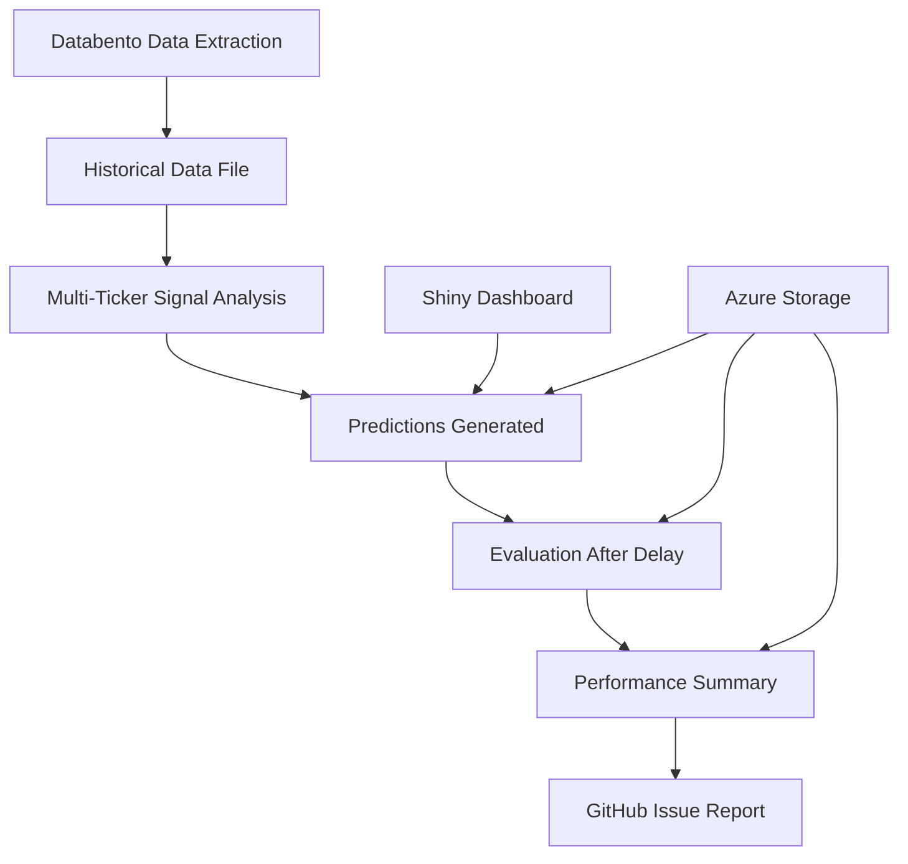

# Multi-Ticker Signal Analysis Setup Guide

This guide explains how to extend the NVDA-only signal analysis system to support multiple tickers using historical data from Databento.

## 🚀 Quick Start

### 1. Prerequisites

- **Databento API Key** - Required for historical data extraction
- **GitHub Secrets** configured for Azure storage and Databento
- **Minimum 2000 records** (2-3 months) of 15-minute data per ticker

### 2. Required GitHub Secrets

Add these secrets to your repository:

```bash
DATABENTO_API_KEY=your_databento_api_key_here
STORAGE_ACCOUNT_NAME=your_azure_storage_account
ACCESS_KEY=your_azure_access_key
CONTAINER_NAME=your_container_name
GITHUB_TOKEN=auto_provided_by_github
```

### 3. Supported Tickers

The system can handle any ticker supported by Databento, including:

- **US Stocks**: AAPL, MSFT, GOOGL, AMZN, TSLA, SPY, QQQ
- **Crypto**: BTC-USD (may require dataset adjustment)
- **Canadian**: AC.TO (Toronto Stock Exchange)

## 📊 Data Extraction Process

### Step 1: Extract Historical Data

For each new ticker, run the **Databento Historical Data Extraction** workflow:

1. Go to **Actions** → **Databento Historical Data Extraction**
2. Click **Run workflow**
3. Configure parameters:
   - **Ticker**: e.g., `AAPL`
   - **Start Date**: Default is 2.5 years ago
   - **End Date**: Default is today
   - **Overwrite**: `false` (unless updating existing data)

The workflow will:
- ✅ Extract 15-minute OHLCV data from Databento
- ✅ Filter to regular market hours (9:30 AM - 4:00 PM ET)
- ✅ Save as `data/TICKER_15min_pattern_ready.csv`
- ✅ Commit the data file to your repository
- ✅ Upload backup to Azure storage

### Step 2: Verify Data Quality

The system automatically validates:
- **Minimum 2000 records** for effective pattern matching
- **Required columns**: timestamp, Open, High, Low, Close, Volume
- **Market hours filtering** and **trading days only**
- **Data completeness** and quality checks

## 🤖 Running Multi-Ticker Analysis

### Automated Execution

The **Multi-Ticker Signal Analysis** workflow runs automatically:
- **Schedule**: Every 2 hours during market hours
- **Auto-detection**: Only processes tickers with sufficient historical data
- **Parallel processing**: Up to 3 tickers simultaneously

### Manual Execution

1. Go to **Actions** → **Multi-Ticker Signal Analysis**  
2. Click **Run workflow**
3. Configure:
   - **Tickers**: `auto` (detect available) or `AAPL,MSFT,TSLA`
   - **Force run**: Enable to run outside market hours

## 🎯 Ticker-Specific Configuration

Each ticker has optimized parameters in `scripts/generate_multi_ticker_predictions.py`:

```python
ticker_configs = {
    'BTC-USD': {
        'evaluation_threshold': 0.5,    # Higher threshold for crypto volatility
        'volatility_multiplier': 2.0,   # Account for crypto volatility
        'confidence_boost': 1.2         # Boost confidence for crypto patterns
    },
    'TSLA': {
        'evaluation_threshold': 0.4,    # Medium threshold for high volatility
        'volatility_multiplier': 1.5,
        'confidence_boost': 1.1
    },
    'AAPL': {
        'evaluation_threshold': 0.25,   # Lower threshold for stable stock
        'volatility_multiplier': 0.8,   # Less volatile
        'confidence_boost': 1.0
    }
}
```

### Key Parameters:
- **evaluation_threshold**: Minimum % move to classify as BULLISH/BEARISH
- **volatility_multiplier**: Adjusts ATR-based thresholds
- **confidence_boost**: Adjusts final confidence scores

## 📈 Performance Monitoring

### Evaluation System

The system automatically evaluates predictions:
- **Delay**: 1+ hours after prediction time
- **Horizons**: 1-hour, 3-hour, end-of-day
- **Metrics**: Direction accuracy, prediction error, confidence calibration

### Performance Reports

Generated automatically with:
- **Individual ticker performance**
- **Comparative analysis across tickers**  
- **Performance trends over time**
- **Automated GitHub issues** for performance alerts

### Accessing Results

1. **Azure Storage**: Structured JSON results in `predictions/`, `evaluations/`, `reports/`
2. **Shiny Dashboard**: Real-time visualization at `multi_ticker_monitor_azure.R`
3. **GitHub Issues**: Automated performance summaries
4. **Local Files**: Results saved in `output/` directory

## 🔧 Troubleshooting

### Common Issues

**"No historical data file found"**
- Run Databento extraction workflow first
- Check if ticker is supported by Databento
- Verify data file was committed to repository

**"Insufficient historical data"**
- Need minimum 2000 records (2-3 months)
- Check if ticker has enough trading history
- Consider different start date for data extraction

**"Error during data extraction"**
- Verify DATABENTO_API_KEY is correct
- Check ticker symbol format (uppercase, correct suffix)
- Review dataset selection (US vs crypto vs international)

### Dataset Mapping

```python
# US Stocks (NASDAQ)
dataset = 'XNAS.ITCH'
venue = 'XNAS'

# Crypto
dataset = 'GLBX.MDP3'  
venue = 'GLBX'

# Toronto Stock Exchange
dataset = 'XTOR.MDP3'
venue = 'XTOR'
```

## 📋 Workflow Overview



## 🎛️ Advanced Configuration

### Adding New Tickers

1. **Check Databento Support**: Verify ticker is available in appropriate dataset
2. **Extract Data**: Run extraction workflow with new ticker
3. **Configure Parameters**: Add ticker-specific config if needed
4. **Test**: Run manual prediction to verify system works
5. **Monitor**: Check performance after sufficient evaluation period

### Custom Pattern Libraries

For specialized analysis, you can:
- **Adjust lookback periods** in ensemble configuration
- **Modify confidence thresholds** per ticker
- **Add custom technical indicators** to pattern matching
- **Implement regime-aware parameters** for different market conditions

## 📞 Support

- **Documentation**: Check existing NVDA implementation for reference
- **Logs**: Review workflow logs and local log files
- **GitHub Issues**: Automated reports highlight performance issues
- **Azure Storage**: Raw prediction and evaluation data for analysis

The system is designed to be robust and self-monitoring, with automatic data quality checks and performance tracking across all supported tickers.